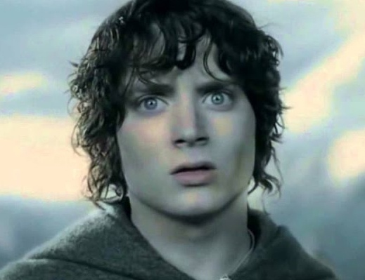
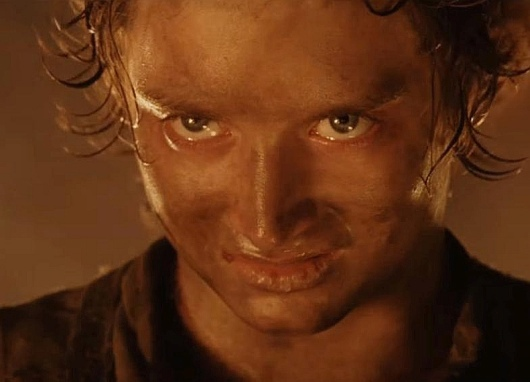
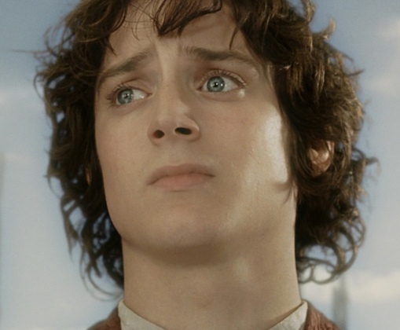
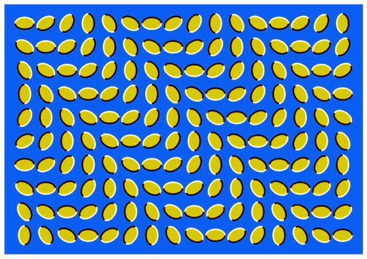

# 4/9 Фазы выгорания

В стрессе происходит блокирование энергии, необходимой человеческой части мозга.

При выгорании иначе — количество этой энергии изначально меньше, чем в нормальном состоянии. Даже при отсутствии стресса ее может не хватать для нормальной работы человеческой части мозга.

Кроме стресса и выгорания существует и просто обычная усталость, состояние "Ego depletion", о котором было написано в предыдущей части.

Выгорание, это когда мы устаем, и не можем восстановиться. Сон перестает помогать, выходные перестают помогать, отпуск не помогает, даже длительный. Выгорание развивается по нисходящей спирали, в которой можно выделить следующие фазы:

# 1. Идеализм и чрезмерность

Классический пример — с понедельника начинаем "новую жизнь". Большое, опьяняющее количество дофамина. Такой дофаминовый душ спадает на третий день. Организм уже начинает говорить — ты перестарался с количеством усилий (из-за чрезмерности).

Ощущение надежды еще существует, но уже начинается сползание в поиск "легкого дофамина" — сериалы, печеньки и т.п.

Фаза короткая, длительностью около 2 недель.

# 2. Истощение

Самый характерный симптом этой фазы — "туман в голове". Просыпаемся как с похмелья. Начинается чувство вины, стыд, ощущение себя негодным. Почти невозможно придумывать новое.

Но из этой фазы легко выйти — смотрим на текущие задачи, расставляем приоритеты и делаем реалистично, то что по силам, не требуя от себя ничего сложного. Правильно подобранное сочетание количества работы и отдыха, ощущение успеха от выполненных задач — этого достаточно чтобы вернуться в нормальное состояние. Но это надо делать!

Однако часто, вместо этого, люди ударяются в новые начинания, чтобы снова почувствовать дофаминовое опьянение как в первой фазе.

Диета, спорт, новые книжки — ложной ценностью становится начинать что-то новое. Вместо этого надо спокойно признать, что даже уже имеющееся требует больше энергии, чем есть у организма.

Правильная позиция — уметь говорить "нет" — и себе, и окружающим. "Сейчас — не могу". "Давайте определим приоритет, добавим задачу в мой список, и я ее сделаю, как только завершу предыдущие".

Фаза истощения длится в районе двух месяцев, если себя из нее не вытащить, то наступает следующая фаза.

# 3. Потеря цели и цинизм

Организм уже понимает направление движения — что уровень энергии за последние несколько месяцев движется в сторону нуля, а "ноль" — это смерть. Включается бессознательный механизм самосохранения. Логика Крокодила и Котика — "это произошло из-за того, что ты слишком многого хотел", и они перестают давать энергию на "хотеть". Цель исчезает, на представление себя в будущем нет энергии, у человека остается только "здесь и сейчас" в сочетании с очень маленьким количеством энергии.

Выход из этого состояния: выяснить, кто виноват. При достаточно развитом самоосознании понятно, что виноват сам — не сбалансировал нагрузку со своими реальными возможностями.

Однако в состоянии с низкой энергией очень тяжело увидеть и признать свою собственную вину. Поэтому чаще начинается цинизм — "все остальные виноваты". Раздражение на остальных и несдержанность в эмоциях поднимает адреналин, это дает ощущение притока энергии. Для многих людей это на долгое время становится заменой реальному выходу из их ситуации. Нет энергии: на эмпатию, на реальное решение проблем.

Если не выйти из этого состояния, но и не компенсировать нехватку энергии за счет адреналина, то через 9-10 месяцев произойдет переход на следующую фазу.

# 4. Отвращение и депрессия

Депрессия выгорания — динамическая. Выглядишь как нормальный человек, но чувствуешь себя не живым — все тяжело, все бессмысленно. Ежедневную рутину продолжаешь только потому, что нет сил даже на понимание "я не хочу".

Происходит реальное повреждение мозга. Мозг пытается перестроиться, чтобы как-то адаптироваться к ситуации хронической нехватки энергии. Постоянный избыток кортизола повреждает клетки мозга, прежде всего клетки памяти. Ухудшается регуляция негативных эмоций. В результате получаем преждевременное старение мозга и постоянное эмоциональное ощущение, что "все плохо".

При выходе из этой стадии выгорания надо учитывать время, необходимое для физиологического восстановления мозга. Образование новых нейронов возможно, но это недели и месяцы. 60% людей восстанавливаются почти до своего исходного уровня, 40% — нет. Поэтому нельзя относиться к выгоранию по принципу "сейчас напрягусь — потом восстановлюсь".

В первый раз весь путь вниз по спирали выгорания занимает около года. Последующие, гораздо быстрее — 2-3 месяца, а при наличии сильных стрессов — несколько недель.

# Что провоцирует выгорание

### Стереотип "выгорают лучшие".

Вместо этого нужен баланс ожиданий и реальности — нельзя ни завышать, ни занижать ожидания от себя.

### Нет права на ошибку.

Это тоже завышенные ожидания, как навязанные самостоятельно, так и навязанные окружением.

### Неработающий индикатор усталости.

"Я устал" — это физическое телесное ощущение. Но наш организм не умеет воспроизводить физические ощущения из прошлого и мы не можем сравнить сегодняшнюю усталость с той, которая была раньше. Из-за этого мы не замечаем постепенное усиление усталости. Кофеин "помогает" сделать индикатор усталости еще менее чувствительным. Когда выгорание, либо восстановление из него, происходит быстро, за несколько недель — тогда разницу чувствуешь.

### Эмоциональное заражение.

Происходит бессознательно, за счет эмпатии. Всего за 15 минут общения между людьми с высоким и низким уровнем энергии, у высоких энергия падает, у низких растет — и выравнивается на примерно одинаковом для всех уровне. Это особенно большая проблема для руководителей — им нужно иметь уровень энергии на 10-15% выше команды, и необходимо уметь все время восстанавливать этот уровень после общения с командой. Действует это и в обратную сторону — выгоревший руководитель тянет за собой команду. Поэтому в первую очередь руководитель обязан помочь самому себе — это тот самый принцип "сначала наденьте кислородную маску на себя".

### Возраст и опыт.

28 лет — время, когда перестаешь быть "бессмертным". Примерно в этом возрасте снижается количество энергии, восстанавливающееся само по себе. Теперь для восстановления нужного количества энергии приходится специально что-то делать — но мало у кого есть такая привычка, ведь раньше необходимости не было.

Молодые выгорают из-за дисбаланса между ожиданием и реальностью. Опытные выгорают под кортизольной нагрузкой от опыта неудач. Но опыт позволяет балансировать желания и возможности.

### "A" и "B" типы личности.

Ярко выраженные люди типа "A" — реакция на стресс "бей", сильная вовлеченность, желание конкурировать, ориентированность на успех — сильнее подвержены выгоранию.

Но при этом более успешные люди подвержены выгоранию в меньшей степени. Причины здесь в том, что успех сам по себе подзаряжает и у успешных людей больше ресурсов (денежных, временных, социальных).

### Рабочая среда способствует выгоранию.

В книге Эрика Гартона "Time, Talent and Energy" описано, какие организационные проблемы способствуют выгоранию.

### Нет авторизации результата. Мерилом работы считают усталость.

Если определять результат своей работы по степени своей задолбанности — одним из результатов всегда будет задолбанность.

Надо научиться практике авторизации результата и ежедневно ее применять. Это ключевая практика как для выхода из выгорания, так и для защиты от попадания в него.

# Диагностика выгорания

Существует много методик и статей на данную тему. Анна упомянула следующие:
- Maslach Burnout Inventory. Подходит только для личного использования, в опроснике задаются прямые вопросы, требующие честных ответов для правильной диагностики;
- Тест Бойко. Хороший, но выводы по результатам сформулированы слишком жестко и их чтение может расстроить без реальной на то причины. Пользоваться осторожно;
- Диагностические зрительные иллюзии Акиоши Китаока. Если для вас работает, то удобная штука — распечатал, повесил недалеко от рабочего места, если картинка "зашевелилась", значит пора отдыхать. Анне больше всего нравятся "кофейные зерна" <http://4.bp.blogspot.com/-mAPTTCZuTD4/UuI_GFuwpvI/AAAAAAAAJa0/4lH3jtQla0A/s1600/393463_313329652017967_172900219394245_1527819_1854333755_n.jpg>;

- Одутловатость под глазами (не "мешки под глазами", а опухлость чуть ниже). Объясняются избыточным количеством жидкости в организме, с помощью которой уставший организм пытается вывести токсины;
- Остекленевший, малоподвижный взгляд — объясняется сниженной подвижностью окологлазных мышц у усталого человека;
- Нарушение координации, неуклюжесть, хроническая забывчивость. Начинаешь задевать дверные косяки, забывать ключи или разбивать чашки — пора отдыхать;
- Нарушение иммунитета;
- Снижение привлекательности. Опухшее лицо, неуклюжие движения, мертвые глаза, неестественная улыбка. Быть лидером в состоянии выгорания невозможно;
- APGAR burnout test. Надо учитывать, что этот тест подразумевает наблюдение в динамике — в нем надо учитывать изменение состояния во времени, и себя по нему оценивать сложнее, чем других;

# Основные идеи выхода из выгорания

Не пытаемся лечить выгорание за счет "дофаминового душа", хватаясь за что-то новое.

Не пытаемся лечить выгорание за счет адреналина, поедая окружающих.

Уехать на год отдыхать — не уберет выгорание.

Помним, что выход из выгорания занимает недели, а выход из четвертой фазы требует еще больше времени для физического восстановления мозга.

Для разных фаз выгорания применимы разные техники выхода из стресса. А некоторые техники наоборот будут вредны. Например, обычный коучинг калечит выгоревших людей — чтобы выйти из зоны комфорта, в нее надо сначала вернуться. Техники медитации также категорически противопоказаны на последних фазах выгорания, на них человеку очень вредно оставаться наедине со своими мыслями.

Также может оказаться полезным определить свой тип выгорания: выгорание стресса; выгорание скуки; псевдо-выгорание некомпетентности или попадание в непривычную среду.

Основные шаги при лечении выгорания: замедлиться, снизить нагрузку; получить поддержку, обеспечить себе безопасную среду; найти подходящее для текущего состояния соотношение количества работы и количества отдыха. Научиться каждую задачу делать в три шага: (1) формирование намерения; (2) чередование сфокусированной работы и отдыха; (3) авторизация результата когда задача завершена.

Для формирования намерения можно использовать метод AGROW, будет в одной из следующих частей конспекта. Описание протокола авторизации результата тоже будет.

Чередовать сфокусированную работу и отдых учимся следующим образом.

Сначала определяем, на какое время сфокусированной работы хватает сил в данный момент:
- максимально концентрируемся и со всей силы работаем над задачей;
- фиксируем сколько прошло времени, когда внимание переключилось с задачи на что-то еще (неважно, любое отвлечение от ухода в несвязанные мысли до переключения на чтение новостей);
- не пытаемся заставлять себя продолжать поддерживать сосредоточенность;

Например, 10 минут работы — 40 минут отдыха. Отдых — обязательно в виде смены вида деятельности, т. е. если было 10 минут за компьютером, то отдых должен быть, например, 40 минут прогулки или уборки в доме. Дальше продолжаем работать такими циклами. Через некоторое время начнет получаться работать 15 минут, после чего снова 40 минут отдыха.

Как понять, сколько времени можем работать — по сфокусированности внимания. Как только на что-то отвлеклись, значит все, силы фокусироваться кончились.

Как понять, сколько времени отдыхать — экспериментально, пробуя разные длительности и продолжая следить за последующим временем сфокусированной работы.

Постепенно, аккуратно увеличиваем время работы и сокращаем время отдыха. Продолжаем следить за своим состоянием и длительностью циклов "работа — отдых" до тех пор, пока они не вернутся к идеальным "помидорным" 25 минут работы — 5 минут отдыха.

Речь здесь идет только о сложных или творческих задачах. Простые или рутинные задачи потому и простые, что не требуют необходимости фокусироваться.

Когда появятся силы думать о будущем — планировать дела в своем будущем от нескольких месяцев до трех лет вперед. Совсем не только рабочие дела, но и приятные, несвязанные с работой: отдых, поездки, обучение. Это даст дополнительную энергию, потому что если мы можем представить себя в будущем, то мы чувствуем себя живыми.

Алекс Корб "Восходящая спираль". Книга описывает методику выхода из депрессии, которая вполне может подойти и для выхода из выгорания.

Анна приводит большую таблицу, в которой для разных фаз выгорания описана характерная для них картина уровней нейромедиаторов/гормонов и применимые на соответствующей фазе методики терапии выгорания.

# Клинический выход из выгорания

Самый суровый вариант — клиника неврозов.

Более мягкий вариант — минимум три недели в санатории со следующими условиями:
- привычный климат в котором живем большую часть жизни;
- полная санаторная нагрузка, все время занят процедурами, не остаешься наедине со своими мыслями;
- заранее известное расписание, заранее назначенное меню, ничего не надо решать, максимально возможный аутсорсинг силы воли;
- ехать одному;
- не работать, не читать, не пользоваться интернетом, полная скука и предсказуемость;
