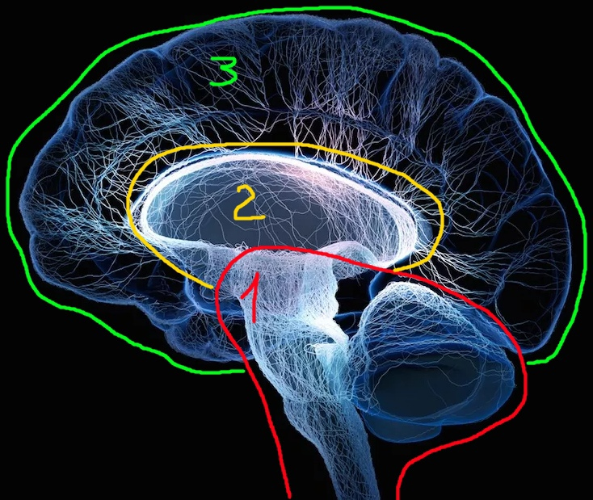

# 1/9 Триединый мозг Маклина (Paul MacLean triune brain model) / Анна Обухова

В 1960 году американский нейрофизиолог Paul D. MacLean предложил функциональную модель мозга в виде трех последовательно развившихся в процессе эволюции структур. Анна кратко и мило называет три этих части: внутренним Крокодильчиком, внутренним Котиком и человеческой частью.

Вопросы того, сколько энергии требует то или иное наше действие, откуда эта энергия берется, как тратится и как восстанавливается — проходят через все темы этого курса. Рассматриваемая ниже модель мозга хороша тем, что позволит понятным образом отслеживать данные энергетические процессы.

# 1. Рептильный мозг (внутренний Крокодильчик)

Ствол нашего мозга и мозжечок. У рыб и рептилий эта часть мозга является основной. Отвечает за общие для всех животных функции:
- инстинкты;
- выживание;
- умение врать;
- реакции "бей или беги";
- понимание своей территории и ее защита;
- понимание иерархии и превосходства;
- умение повторять действия, в том числе и за кем-то;

# 2. Лимбический мозг (внутренний Котик)

Внутренняя часть мозга над стволом. Отвечает за функции, выраженные у млекопитающих гораздо ярче, чем у рептилий:
- эмоции, чувства: мне нравится, мне хорошо, мы вместе;
- групповое поведение: друг, любимый, доверие, принятие;

# 3. Неокортекс / новая кора (человеческая часть мозга)

Верхний слой мозга, в случае человека и некоторых млекопитающих составляет основной объем мозга. Отвечает за:
- сознание, интеллект, речь, мышление, счет;
- абстрактные понятия и их перевод в конкретные действия;

Но, к сожалению, основная функция человеческой части мозга — запретительная. "Не дать Котику и Крокодилу испортить тапки". Более ранние части мозга необходимы для выживания, но не умеют разумно действовать в условиях повседневной жизни современного человека.

Крокодил: "Я нахожусь в стрессе, мне нужно сожрать начальника".
 
Котик: "Поддерживаю, это наилучший выход. Ну или убежать".
 
Человек: "Нет. Стоим смирно. Молчим. Терпим".

Это принятие решений и концентрация внимания с отбрасыванием всего, что несущественно для человеческой части мозга. Это волевые усилия, и они требуют большого количества энергии.

# Энергия на действие

Неокортекс сам не генерирует энергию на действие. Нужная ему энергия генерируется в рептильной части мозга и проходит через лимбический мозг. Из-за этого нам для осуществления человеческих действий приходится постоянно договариваться с Крокодилом и Котиком, но сознательно управлять происходящими в них процессами мы не можем. Они же, наоборот, имеют возможность перекрывать поступление энергии в человеческую часть мозга.

**1. Ретикулярная формация** — генератор энергии. Находится в рептильной части мозга, т.е. под контролем Крокодила.

Максимально возможный объем энергии, который может быть сгенерирован клетками ретикулярной формации называется "ранговым потенциалом человека". Он отличается у разных людей и во многом от него зависит максимально возможный масштаб достижений, посильный данному человеку.

Крокодил отдаст энергию на действие если он находится в безопасности и если результат данного действия полезен ему с точки зрения безопасности, эволюционного выживания и удовольствия.
В первую очередь Крокодил отдаст энергию не на человеческие действия, а на физиологические потребности организма — например на восстановление физиологических процессов после стресса.

**2. Дофаминовая система** — транспортер энергии. Находится в лимбическом мозге, т.е. под контролем Котика.

Котик может усилить проходящий поток энергии когда что-то нравится, когда понятен результат, когда понятен прогресс к результату, когда результат достижим и за него можно получить награду.
 
Котик ослабит поток энергии, если есть сомнения в своих способностях, если есть страх или предвкушение неудачи.
 
Котик заблокирует поток энергии в случае стресса, по принципу "нам сейчас не до человеческих действий, нам надо восстанавливаться".
 
Котик заблокирует энергию во время переживания очень сильных эмоций (не важно, положительных или отрицательных).

При нормальном состоянии Крокодил генерирует и отдает большое количество энергии, а Котик не препятствует ее потоку. Мы при этом регулируем наши действия именно человеческой частью нашего мозга (не даем Крокодилу и Котику "испортить тапки").

Но в состоянии стресса энергия будет заблокирована сразу в двух перечисленных частях мозга. Именно поэтому нам в стрессе так трудно: думать, следовать своим целям, концентрироваться и помнить, определять приоритеты, видеть будущее, придумывать новое, хотеть, радоваться, расслабляться. Состояние, когда человеческая часть мозга получает очень мало энергии, Анна называет "угон мозга".

# Нейрофизиология перехода желания в действие

В нормальном состоянии "захотел — сделал":
- дофамин генерируется в рептильной части мозга на стыке с лимбической частью;
- дофамин проходит через миндалину, это область лимбического мозга, активная при сильных эмоциях;
- дофамин поступает в переднюю поясную извилину, это область на стыке лимбического мозга и неокортекса, работающая "переключателем" желания в действие и обратно;
- неокортекс получает необходимую для действия энергию;

Это называется мезокортикальный путь дофамина. В нормальном состоянии переход захотел-сделал происходит почти автоматически и при этом нет проблемы чего-то захотеть.

В стрессовом состоянии:
- дофамин генерируется в рептильной части мозга на стыке с лимбической частью;
- дофамин проходит через миндалину, которая в активном состоянии не пропускает его дальше из лимбического мозга в неокортекс;

Это называется мезолимбический путь дофамина. В таком состоянии мы можем переводить в действия только очень примитивные желания животного уровня, а более сложные желания даже просто захотеть не можем без дополнительного усилия.
