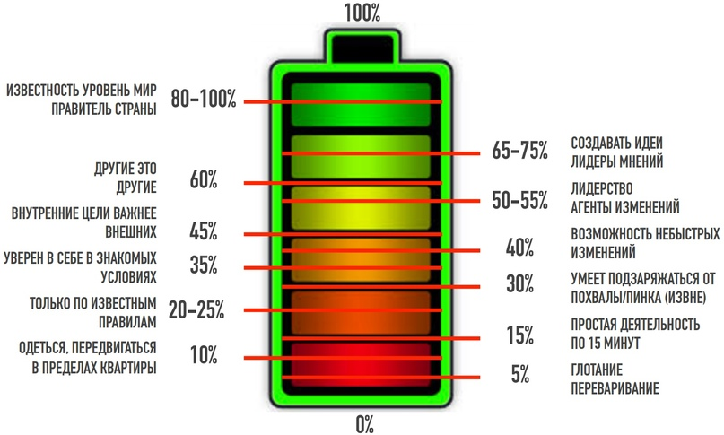

# 5/9 Ресурсная модель человека / Анна Обухова

Наше самочувствие, наш уровень энергии в конкретный момент времени, напрямую влияют на нашу способность совершать сложные действия человеческой частью мозга. Это работает и в обратную сторону — по действиям человека можно определить его уровень энергии.

Ранговый потенциал — сколько вообще у конкретного человека есть энергии. Это наш максимально возможный "заряд батарейки". У разных людей он разный и его значение это наша врожденная характеристика. Зависит от того, как во время развития плода и в раннем возрасте развились зоны мозга, ответственные за генерацию и транспортировку энергии. На клеточном уровне генерация энергии происходит в митохондриях, где питательные вещества преобразуются в молекулы АТФ. Молекулы АТФ, в свою очередь, используются в качестве универсального топлива другими клетками организма. Интересно, что свойства нашего "генератора энергии" наследуются от матери.

Количество энергии в конкретный момент времени называют витальностью (VQ). Максимальное значение равно ранговому потенциалу. От значения витальности напрямую зависят значения ментального и эмоционального интеллекта (IQ и EQ) в конкретный момент времени. Проще говоря, когда мы устаем, у нас хуже получаются сложные действия.

Простой способ определить свой ранговый потенциал — вспомнить свои мечты. Человек, способный всерьез представлять себя персоной мирового уровня, имеет высокий ранговый потенциал. У многих людей предел мечтаний — заурядная должность в заурядной фирме, это говорит о невысоком ранговом потенциале. "Если у меня есть неограниченное количество денег и времени — каким и кем бы я хотел быть?" Ранговый потенциал не даст помечтать о чем-то, что ему не соответствует. Большой и низкий ранговые потенциалы — не редкость, но в целом у него нормальное распределение (у большинства людей средний ранговый потенциал).

Ранговый потенциал можно ухудшить. Например, неполное восстановление после выгорания снижает ранговый потенциал на 5%. Мозг не будет позволять захотеть столько же, сколько хотели до выгорания: "ты хотел слишком много и выгорел. Я позволю тебе снова хотеть, но чуть меньше, чем раньше". Но обычно значение рангового потенциала стабильно в течение жизни. Витальность же наоборот, ежедневно меняется в диапазоне от минимальных значений до значения рангового потенциала.

Более сложным способом измерить ранговый потенциал можно считать "Зефирный эксперимент" (Stanford marshmallow experiment). Одновременно он позволяет оценить и текущий уровень развития неокортекса для детей дошкольного возраста.

NT: дальнейшее развитие этого эксперимента и опровержение его первоначальных выводов иллюстрирует мою точку зрения — лично я считаю, что умение быстро реагировать на ситуацию, умение "схватить приз здесь и сейчас", понимание ценности "синицы в руках" может быть таким же важным, как и умение выждать ради более крупного приза. Все зависит от ситуации и от изменчивости среды в которой находишься. А умение сознательно выбирать между этими двумя стратегиями — ВАРИАБЕЛЬНОСТЬ поведения — вообще один из важнейших жизненных навыков.

Теперь более подробно о том, какие способности становятся нам доступны в зависимости от заряда батарейки.

# 0%

Состояние комы.

# 5%

Способности:
- Самостоятельно глотать пищу.
- Думать о будущем в пределах ближайшей пары минут.

# 10%

Соответствует состоянию "смертельной усталости", когда голова не работает, не получается слушать других.

Способности:
- Самостоятельно одеться и передвигаться в пределах квартиры.

# 15%

Способности:
- Выбрать одежду, приготовить еду, заниматься простой деятельностью около 15 минут.
- Думать о будущем в пределах получаса.

# 20-25%

Способности:
- Доехать до работы, передвижение по известному маршруту.
- Делать уже известные действия, по известным правилам. В основном это ручной труд, конвейерная работа.
- Начать или закончить работу по стимулу извне (самостоятельно понять, что надо начать или закончить — не можем).
- Думать о будущем в пределах одного-двух дней.

При сползании энергии на этот уровень с более высокого:

25% и ниже соответствует состоянию "угона мозга". Это тот уровень, куда нас сбрасывает при остром стрессе.

Это уровень энергии, при котором Крокодил побеждает Человека. Мы можем делать привычные дела, так как их "делает Крокодил", но избегаем чего-то незнакомого, плохо сдерживаем эмоции и т. п.

Сползание энергии с 20% до 10% соответствует четвертой фазе выгорания "Отвращение и депрессия".

# 30%

На этом уровне появляется Котик (до этого был только Крокодил) — человек становится сильно зависимым от группы.

Способности:
- Самостоятельно (а не только извне) определить себе занятие, но без способности решить большую комплексную задачу, без способности превратить абстрактное задание в набор конкретных действий.
- Корректировать свое поведение когда это нужно группе или руководителю (речь здесь не про умение воспринимать изменения, а про умение подстраиваться под группу).
- Подзаряжаться от подзатыльника/пинка извне.

При сползании энергии на этот уровень с более высокого теряется способность подзаряжаться от результата собственной работы, и поэтому энергосистема человека становится дефицитной — работа только истощает, но сам факт завершения очередной задачи не дает энергии.

Сползание энергии с 30% до 20% соответствует третьей фазе выгорания "Потеря цели и цинизм".

# 35%

Способности:
- Планировать время (успеваю / не успеваю).
- Быть уверенным в себе в знакомых условиях (если нет изменений).
- Подзаряжаться от результата собственной работы (появляется возможность сделать энергосистему организма не дефицитной).
- Подзаряжаться от эстетики, в зачаточном виде появляется понятие "сделать красиво".

> У офисных работников с высшим образованием среднестатистический уровень энергии — 33%. Вот такой печальный факт.

У этого печального факта есть печальное следствие. Если вы особо чувствительны к чужому состоянию, если у вас ярко выражена подверженность эффекту эмоционального заражения от других людей, то вам лучше не ездить в общественном транспорте — все эти люди с их средними 33 процентами будут тянуть ваш уровень энергии вниз.

При сползании энергии на этот уровень с более высокого пропадает способность реагировать на изменения — при изменениях человек впадает в панику "я не смогу это сделать". В этом случае сопротивление изменениям происходит не на уровне логики, а на уровне эмоций — "нет, у нас не получится", "это сделать невозможно". На более низких уровнях энергии человек тоже не воспринимает изменения, но проявляется это иначе — саботажем или явной агрессией.

Сползание энергии с 35% до 30% соответствует второй фазе выгорания "Истощение".

Как обычно выглядят дневные уровни энергии человека в выгорании: 30-30-30-25-30-30-30-60-30-30-25-.... Обычное ощущение при этом "я мог бы больше, если бы захотел, но ничего не хочется".

В стрессе картина другая — чувствуешь себя обычно лучше, чем в выгорании, но не уверен, каким будешь завтра. Пытаешься сегодня сделать как можно больше из-за неизвестного состояния "завтра". И это только увеличивает вероятность плохого самочувствия завтра.

# 40%

На этом уровне человеческая часть мозга начинает быть способной контролировать Крокодила и Котика.

Способности:
- Понимать личные границы (свои и чужие, умение не ввязываться в конфликт).
- Видеть чужой конфликт со стороны, не вовлекаясь в него.
- Руководить (но не быть лидером).
- Реагировать на не быстрые изменения (нет паники от изменений).
- Переключать деятельность по желанию (сила воли).
- Думать о будущем в пределах месяца (например, не потратить всю зарплату сразу).

При сползании энергии на этот уровень с более высокого теряется способность строить планы на несколько лет вперед.

Сползание энергии с 40% до 35% соответствует первой фазе выгорания "Идеализм и чрезмерность".

# 45%

Принципиальный уровень, на котором человек начинает быть способным проявлять себя как самостоятельная независимая личность.

Появление способности к самоорганизации и абстрактному мышлению позволяет выполнять большие задачи, самостоятельно их уточняя и разделяя на части.

Это минимальный уровень энергии, чтобы полноценно выполнять работу программиста (не быть просто "кодером").

Это уровень энергии, при котором можно говорить, что человек не находится в выгорании.

Это минимальный уровень энергии, при котором для человека начинают работать методики коучинга.

На этом уровне энергии люди начинают высказывать свое мнение, сомневаться в нужности тех или иных задач и искать в них смысл — из компаний с нездоровой атмосферой таких людей часто увольняют.

Способности:
- Отличать свои собственные внутренние цели от внешних и понимать, что внутренние цели могут быть важнее, двигаться к своим целям.
- Противостоять манипулированию.
- Быть самоорганизованным.
- Абстрактно мыслить, осознавать причинно-следственные связи в своих действиях.
- Осознавать необходимость изменений и производить изменения самостоятельно (двухступенчатая сила воли — изменить что-то сейчас, чтобы стало хорошо потом).
- Цвет, вкус, эстетика, "сделать красиво" не просто ощущаются, а становятся мотиваторами.

При сползании энергии на этот уровень начинает переставать работать обычный "помидорный" ритм 25 минут работы — 5 минут отдыха. Длительность сфокусированной работы станет меньше, а отдых будет требоваться более длительный.

# 50-55%

Это стабильное количество энергии, ниже которого достигший его человек обычно не просаживается.

Способности:
- Лидерство, человек становится "интересным", индивидуальность и очевидная заметность на фоне среднестатистических 33%.
- Дойти до результата самостоятельно, не завися от мнения группы (+ могут появиться последователи).
- Работа с большими абстракциями, большим количеством людей, большим количеством задач (достаточно, чтобы быть топ-менеджером).
- Быть агентом изменений.

# 60%

Это уровень энергии, необходимый для организационных консультантов, коучей, психологов — на этом уровне появляется понимание, что не все из своей головы надо насаждать другим людям.

Если на уровне энергии 45% человек получает способность высказывать свое мнение, то на уровне энергии 60% — способность делать это осторожно.

Способности:
- Истинная эмпатия.
- Понимать, что другие — это другие.
- Понимать, что не все надо менять, что других не надо перевоспитывать.

# 65-75%

Уровень ярко выраженной социальной значимости, при котором появляются стабильные последователи. Лидеры мнений.

Это уровень энергии, необходимый для людей, которые создают компании или продукты. Более того, на этом уровне сила внутреннего желания сделает практически невозможным не делать что-то "свое собственное" — стартап, комьюнити, активное хобби и т. п.

Способности:
- Возможность создавать идеи, создавать то, что не существовало раньше.

# 80-100%

Уровень исторической личности. 80 или 100 процентов у него было — поймут только следующие поколения по тому, насколько человек изменил мир (не обязательно к лучшему).

# Уровень энергии в команде

Для команды средний уровень в 45% энергии достаточен, чтобы это была самоорганизованная scrum-команда.

Для лидера scrum-команды необходимый уровень энергии — 50-55%.

Для коучей и менеджеров нескольких проектов рекомендуемый уровень энергии — в районе 60%.

Для человека придумывающего идеи, владельца продукта, необходимый уровень энергии — 65-75%.

Такое распределение людей по уровням энергии является оптимальным — разница в уровне энергии между постоянно работающими друг с другом людьми будет в комфортном диапазоне.

Критической является разница между энергией людей в 20 и более процентов. Два человека с такой разницей в уровне энергии перестают друг друга понимать. У них становятся слишком разными возможности, представление о времени, представления об изменениях, желания.

У человека, уровень энергии которого выше среднего в группе постоянно будет ощущение, что у него энергию отбирают.

У человека, уровень энергии которого ниже среднего в группе постоянно будет ощущение, что от него требуют больше, чем он может дать.

На низких уровнях энергии больше вероятность агрессивного поведения или выученной беспомощности. Поэтому очень высока вероятность конфликтов, что будет порождать новые стрессы. Для руководителя более практичным решением может оказаться убрать из команды человека с заметно более низким уровнем энергии — чем пытаться вытягивать и его и остальных, чей уровень энергии упал вследствие общения с ним.
