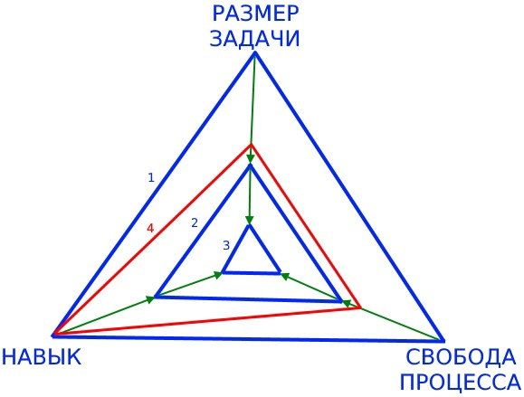

# 6/9 Треугольник самоорганизации / Анна Обухова

Рассмотренная в предыдущей части ресурсная модель человека описывает зависимость между уровнем энергии человека и его действиями.

В отличие от нее, модель "Треугольника самоорганизации" посвящена взаимодействию человека с рабочей средой, в которой он находится.

Треугольник самоорганизации описывает зависимость между следующими характеристиками:
- **НАВЫК**, профессиональные навыки человека, необходимые для рассматриваемого рабочего процесса;
- **РАЗМЕР ЗАДАЧИ**, маленький для коротких понятных задач и большой для сложных и долгих задач с расплывчатой формулировкой;
- **СВОБОДА ПРОЦЕССА**, маленькая для строго и подробно формализованных процессов, большая для неограниченной процессами работы на результат;

У треугольника самоорганизации есть следующие свойства:
1. Для комфортной рабочей среды треугольник является равносторонним — все три характеристики сбалансированы друг с другом. Любое искривление треугольника сделает среду менее комфортной. В качестве такого примера на рисунке красным цветом (4) показана ситуация, в которой человек с высокими навыками вынужден работать над простыми для него задачами в формализованном процессе.
2. Сильному специалисту не комфортно в простой среде. Если рабочая среда ориентирована на выполнение простых задач людьми невысокой квалификации по формальному процессу или с микроменеджментом (2), или если это среда конвейерной работы (3), то такому человеку будет "тесно". Для него больше подойдет работа по неформальному процессу над сложными задачами (1).
3. Начинающему специалисту или человеку с низким уровнем энергии не комфортно в свободной сложной среде. Если для человека комфортна рабочая среда (2) или (3), то в более свободной среде (1) он "потеряется". Человек будет чувствовать себя неуверенным, некомпетентным: "мне дают большие задачи, они для меня слишком сложные, мне не объясняют как я должен над ними работать".

NT: всегда, даже нанимая супер-специалиста в крутую команду, разумно обеспечить ему адаптационный период. Если у вас команда типа (1), то в первые две недели надо помочь новенькому пройти по пути (3)-(2)-(1). Я всегда старался организовать адаптацию таким образом, чтобы первая реальная задача была выполнена в первую неделю работы. Очень простые первые задачи дают новому человеку заряд уверенности в своих силах, и, одновременно, облегчают знакомство с местным инструментарием и процессами.

Противостоять стрессу мы можем по двум направлениям: меняя себя или меняя внешнюю среду. Правильным будет использовать оба направления, если есть такая возможность. Для себя самих мы учимся успокаиваться, восстанавливаться и планировать свой уровень энергии. Изменение рабочей среды при борьбе со стрессом заключается прежде всего в ее упрощении. Как для себя, так и для команды, можно заметить момент когда уровень энергии снизился настолько, что работать в среде (1) стало некомфортно — и изменить среду в сторону более простой и формальной (2).
